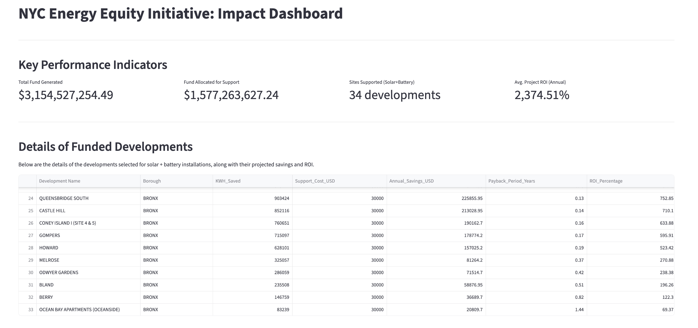
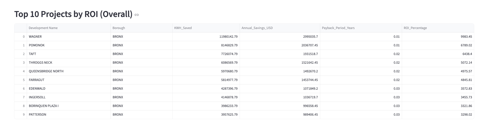
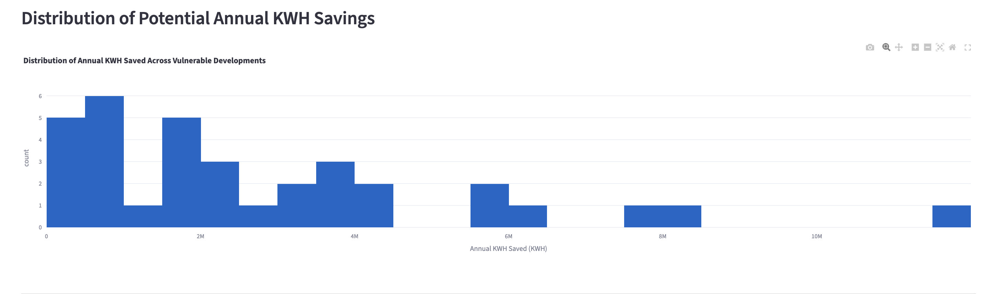
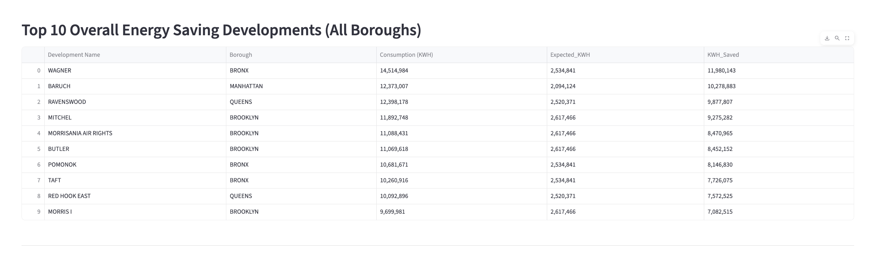

## 🏙️ NYC Energy Equity Initiative
Data-Driven Strategy for Sustainable Investment in Vulnerable NYC Communities

This project analyzes municipal electricity consumption, demographic vulnerability, and future forecasting to build a data-driven investment framework for energy equity in New York City.
Using a structured methodology, the analysis identifies overconsuming developments, simulates potential savings, forecasts long-term trends, and evaluates cost-effectiveness through ROI analysis.

The final output includes:
✅ An interactive Streamlit dashboard 
✅ A master Excel report 
✅ Forecasting results 
✅ ROI evaluation 
✅ Processed datasets used in investment planning

## 📊 Data Sources
The `data.zip` file contains the original datasets used in this project:

- **Electric_Consumption_data.csv** — NYC electricity usage dataset
- **New_York_City_Population.csv** — Population & demographic dataset

### These datasets were used for:
- Energy burden analysis
- Demographic correlation studies
- Prophet-based future electricity consumption forecasting
- Streamlit dashboard visualizations

🔧 Technology Stack
| Category | Tools | Purpose |
|---------|-------|----------|
| Language | Python | Data analysis |
| Libraries | Pandas, NumPy | Preprocessing |
| Forecasting | Prophet | 36-month projection |
| Visualization | Streamlit, Plotly | Dashboard |

## 📌 Project Overview

NYC experiences significant disparities in electricity consumption across boroughs—especially within low-income, vulnerable communities.
This project builds a transparent and data-driven methodology to:

✅ Identify developments that exceed borough consumption norms 
✅ Simulate expected usage and calculate potential savings 
✅ Forecast long-term usage under multiple scenarios 
✅ Prioritize funding for high-impact interventions 
✅ Evaluate ROI for solar + battery installations

The final goal is to support sustainable, equitable energy solutions through measurable insights.

---

## 🔬 Methodology
A clearly structured, multi-step methodology was used:

### 1️⃣ Flagging Developments Exceeding Borough Norms

- ✅ **Vulnerability Assessment**  
  Boroughs with **Median Household Income < $55,000** (e.g., BRONX) were classified as economically vulnerable.

- ✅ **Overconsumption Detection**  
  Developments were flagged as overconsuming if total KWH usage exceeded the borough’s average per-capita electricity consumption.

---

### 2️⃣ Simulating Expected Consumption & Potential Savings

- ✅ **Expected Consumption (Expected_KWH)**  
Expected_KWH = Estimated Population × Borough Per Capita KWH

- ✅ **KWH Savings Calculation**  
KWH_Saved = Actual Consumption – Expected_KWH

This represents the annual savings potential if usage aligns with borough norms.

---

### 3️⃣ Forecasting with Prophet (36-Month Projection)

The Prophet model forecasts electricity demand under two scenarios:

- **Business-as-Usual**  
- **Reduced Usage (after interventions & savings)**  

These projections illustrate the long-term economic and environmental impact of targeted investment.

---

## 💰 Key Results & Systemwide Impact

### ✅ A. Potential Fund Generation

Total savings opportunity based on excess KWH and rate assumption ($0.25 / KWH):

**💰 $3,154,527,254.49**

**Support Fund Allocation (50%)**  
➡️ **$1,577,263,627.24** for renewable energy installations.

---

### ✅ B. Prioritized Renewable Energy Projects

A total of **34 developments** were selected based on:

- Vulnerability level  
- Overconsumption severity  
- KWH savings potential  

Each development receives:
- ✅ Solar panels  
- ✅ Battery backup system  

*(Estimated cost per site: $30,000)*

---

### ✅ C. ROI Analysis

- ⚡ **Average Payback Period:** 0.2 years (~2.4 months)
- 📈 **Average Annual ROI:** 2,374%+

These results demonstrate exceptionally strong financial and social returns from targeted investment.

---

## 📦 Output Files (Analysis Results)

### 1. `energy_efficiency_report_data.xlsx` — Master Consolidated Report
Contains:
- All_Vulnerable_Devs  
- Funded_Developments  
- ROI_Analysis (KWH Saved, Cost, Payback, ROI)

### 2. `overconsuming_developments.csv` — Flagged High-Consumption Sites
Columns:
- Development Name  
- Borough  
- Consumption (KWH)  
- Exceeds_Avg  

### 3. `simulated_savings_per_development.csv` — Estimated KWH Savings
Columns:
- Development Name  
- Expected_KWH  
- KWH_Saved  
- Population  

---

## 📓 Notebooks

- `notebooks/Electric_Consumption_Analysis.ipynb`  
Includes:
- Data preprocessing  
- Vulnerability analysis  
- Overconsumption tagging  
- Savings simulation  
- Prophet forecasting  
- Visualizations & exports  

---
### 📊 Dashboard Visualization
The key analytical results and ROI projections of this project can be visually explored through the dashboard below.

🪪 License

MIT License

